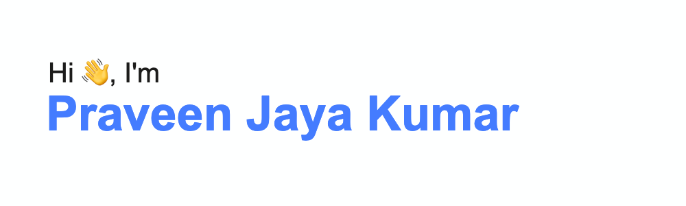

- 🔭 I'm a passionate web devleoper working @<a href="https://www.comcasttechnologysolutions.com/" target="_blank">Comcast</a>
- 🌱 I'm currently learning Go.

<h4>Tech Stack</h4>

&nbsp;
&nbsp;
&nbsp;
&nbsp;
&nbsp;
&nbsp;

<h4>I'm currently learning</h4>

<h4>Contact me</h4>

<!--
**praveencodes/praveencodes** is a ✨ _special_ ✨ repository because its `README.md` (this file) appears on your GitHub profile.

Here are some ideas to get you started:

- 🔭 I’m currently working on ...
- 🌱 I’m currently learning ...
- 👯 I’m looking to collaborate on ...
- 🤔 I’m looking for help with ...
- 💬 Ask me about ...
- 📫 How to reach me: ...
- 😄 Pronouns: ...
- ⚡ Fun fact: ...
-->
